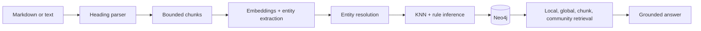

# Provenance GraphRAG

[](https://github.com/aviasthana1/provenance-graphrag/actions/workflows/ci.yml)
[](LICENSE)
[](pyproject.toml)

A modular GraphRAG toolkit that turns Markdown or plain text into a queryable Neo4j graph while preserving where every extracted fact came from.

The pipeline keeps the source hierarchy, chunks content, extracts entities and typed relationships, resolves duplicates, adds similarity and inferred edges, and links entities back to their source chunks. A retrieval agent can then combine entity, passage, and community search.

> [!IMPORTANT]
> This is an alpha toolkit for experimentation and application development. Entity extraction and inference can produce errors. Keep source citations visible and verify generated answers when accuracy matters.

## What makes it useful

- **Provenance first:** `Source → Topic → Chunk → Entity` paths remain queryable.
- **Hierarchy aware:** Markdown headings become nested topic nodes instead of disappearing during chunking.
- **Hybrid retrieval:** local entity traversal, semantic chunk search, global summaries, and community reports share one graph.
- **Resolution and inference:** fuzzy and embedding similarity merge candidate duplicates; conservative rules add transitive and lexical edges.
- **Repeatable ingestion:** source, heading, and chunk identifiers are deterministic for the same corpus and input.

## Architecture



## Requirements

- Python 3.11 or later
- Neo4j 5.x
- Neo4j Graph Data Science for community detection
- Gemini API access for embeddings
- OpenRouter access for extraction, summaries, and answer generation

## Quick start

```bash
git clone https://github.com/aviasthana1/provenance-graphrag.git
cd provenance-graphrag
python -m venv .venv
source .venv/bin/activate
pip install -e '.[dev]'
cp .env.example .env
docker compose up -d
```

Set the provider keys and match `NEO4J_PASSWORD` to your local database. Then ingest a document:

```bash
provenance-graphrag \
  --text-file architecture.md \
  --corpus-id system-design \
  --source-title "System design notes"
```

Use `--generate-corpus-id` when you do not need a stable namespace.

## Graph model

| Node | Purpose |
| --- | --- |
| `Source` | One ingested document and its metadata |
| `Topic` | A heading and its place in the document hierarchy |
| `Chunk` | A bounded passage used for retrieval and provenance |
| `Entity` | A resolved person, organization, concept, technology, or method |
| `Community` | A graph cluster with a generated summary |

Core edges include `HAS_TOPIC`, `HAS_CHUNK`, `MENTIONS`, `NEXT_CHUNK`, `SIMILAR`, `IN_COMMUNITY`, and extracted domain relationships. Dynamic relationship types are normalized and validated before they enter Cypher.

## Use the algorithms without providers

Importing the package does not require credentials. Pure parsing, chunking, similarity, resolution, and inference functions can run independently:

```python
from provenance_graphrag import (
    flatten_heading_tree,
    parse_heading_hierarchy,
    split_content_into_chunks,
)

roots = parse_heading_hierarchy("# Retrieval\n\nGround answers in evidence.")
headings = flatten_heading_tree(roots)
chunks = split_content_into_chunks(
    headings[0].content,
    topic_id=headings[0].id,
    source_id="source-1",
    corpus_id="demo",
    heading_path="Retrieval",
)
```

Provider and database credentials are checked only when a networked pipeline stage runs.

## Development

```bash
ruff check .
ruff format --check .
pytest
python -m build
```

## Limitations

- Provider adapters currently target Gemini embeddings and OpenRouter chat models.
- Community reports require Neo4j Graph Data Science.
- Inference rules are heuristic and should be tuned for each domain.
- Ingestion is repeatable at the identifier level, but it is not a full transactional synchronization engine.
- Benchmark quality, latency, and cost on your own corpus before production use.

## License

[MIT](LICENSE)
